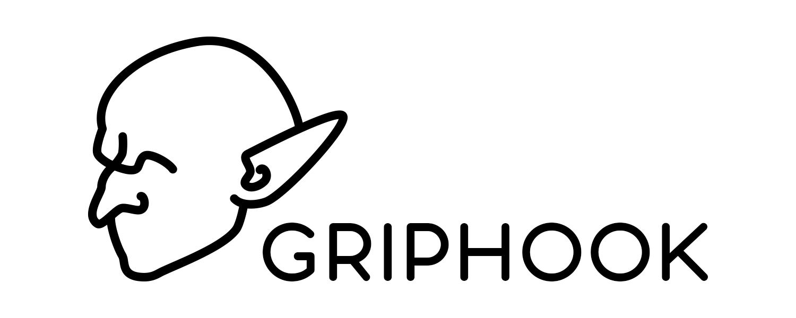

# Griphook

Griphook is a tool to validate and visualize Iranian bank information.

It can validate [IBAN](https://en.wikipedia.org/wiki/International_Bank_Account_Number)s and [PAN](https://en.wikipedia.org/wiki/Payment_card_number)s, find issuer bank and more while caching the results.



*[Griphook](https://harrypotter.fandom.com/wiki/Griphook) was a goblin who worked at Gringotts Wizarding Bank in Diagon Alley.*

## Methods

### PAN

#### `validatePAN(value)`

Will check if value is a valid PAN or not (returns a boolean).

``` js
import { validatePAN } from 'griphook';

console.log(validatePAN('6219861032799560')); // true
```

#### `visualizePAN(value, options)`

Will format a PAN (Returns a String).

``` js
import { visualizePAN } from 'griphook';

console.log(visualizePAN('6219861032799560')); // '6219-8610-3279-9560'
```

you can pass an optional object to this method:
| option       | type    | default value | description                                         |
|--------------|---------|---------------|-----------------------------------------------------|
| spacerChar   | String  | '-'           | a character to use as spacer between each 4 digits  |
| censor       | Boolean | false         | whether should censor a part of PAN or not          |
| censorChar   | String  | '*'           | a character to use as replacement of real digits    |
| censorLength | Number  | 4             | number of censored digits (will censor from center) |

#### `findBankByPAN(value)`

Will Find Bank Info With PAN IIN+ (Returns an Object)

``` js
import { findBankByPAN } from 'griphook';

console.log(findBankByPAN('6219861032799560'));
// {
//    "name": "saman",
//    "name_farsi": "سامان",
//    "icon": "Saman.svg",
//    "iban_nbc": "056",
//    "pan_iin": [ "621986" ]
// }
```

You should download icons from [here](https://github.com/zegond/logos-per-banks) and host them locally (for now).

### IBAN

#### `validateIBAN(value)`

Will check if value is a valid IBAN or not (returns a boolean).

``` js
import { validateIBAN } from 'griphook';

console.log(validateIBAN('IR410560090180001896622001')); // true
```

#### `visualizeIBAN(value, options)`

Will format a IBAN (Returns a String).

``` js
import { visualizeIBAN } from 'griphook';

console.log(visualizeIBAN('IR410560090180001896622001')); // 'IR41-0560-0901-8000-1896-6220-01'
```

you can pass an optional object to this method:
| option       | type    | default value | description                                         |
|--------------|---------|---------------|-----------------------------------------------------|
| spacerChar   | String  | '-'           | a character to use as spacer between each 4 digits  |

#### `findBankByIBAN(value)`

Will Find Bank Info With IBAN NBC+ (Returns an Object)

``` js
import { findBankByIBAN } from 'griphook';

console.log(findBankByIBAN('IR410560090180001896622001'));
// {
//    "name": "saman",
//    "name_farsi": "سامان",
//    "icon": "Saman.svg",
//    "iban_nbc": "056",
//    "pan_iin": [ "621986" ]
// }
```

You should download icons from [here](https://github.com/zegond/logos-per-banks) and host them locally (for now).

#### Other

## `findBankByName(value)`

Will Find Bank Info With Their English Name (Returns an Object). English Name Must Be Lower Case.

``` js
import { findBankByName } from 'griphook';

console.log(findBankByName('saman'));
// {
//    "name": "saman",
//    "name_farsi": "سامان",
//    "icon": "Saman.svg",
//    "iban_nbc": "056",
//    "pan_iin": [ "621986" ]
// }
```

## `findBankByFarsiName(value)`

Will Find Bank Info With Their Farsi Name (Returns an Object).

``` js
import { findBankByFarsiName } from 'griphook';

console.log(findBankByFarsiName('سامان'));
// {
//    "name": "saman",
//    "name_farsi": "سامان",
//    "icon": "Saman.svg",
//    "iban_nbc": "056",
//    "pan_iin": [ "621986" ]
// }
```

You should download icons from [here](https://github.com/zegond/logos-per-banks) and host them locally (for now).
